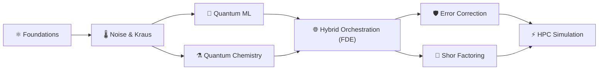

# Hi there, I'm Ashraf Khan 👋 

### ⚛️ Applied Quantum Computing, Solutions Architecture & HPC Simulation Research Engineer

I design and build production-grade hybrid quantum-classical pipeline orchestrators, smart backend routers, variational optimizers, quantum machine learning models, surface code error correction, and GPU/vectorized statevector engines from mathematical first principles.

---

## 🌟 Featured Quantum & Solutions Architecture Projects

| Repository | Focus Area | Highlights & Math |
| :--- | :--- | :--- |
| **[`quantum-hybrid-orchestration`](https://github.com/aashiq-parinda/quantum-hybrid-orchestration)** | 🌐 **Solutions Architecture / FDE** | Preprocessing $\rightarrow$ Quantum Dispatch $\rightarrow$ Postprocessing loop, dual-backend router (Sim vs QPU), job queue state machine, cost/latency benchmarks, VQE & QAOA adaptability, Executive Translation Whitepaper. |
| **[`quantum-engineering-portfolio`](https://github.com/aashiq-parinda/quantum-engineering-portfolio)** | 🏆 **Master Portfolio** | Master index & architecture map consolidating all 8 research repositories (131/131 unit tests passing). |
| **[`quantum-computing-foundations`](https://github.com/aashiq-parinda/quantum-computing-foundations)** | ⚛️ **Foundations & Oracles** | Statevector $\mathbb{C}^{2^N}$, Grover's search $O(\sqrt{N})$, QFT, QPE, Deutsch-Jozsa, Teleportation. |
| **[`quantum-simulation-noise`](https://github.com/aashiq-parinda/quantum-simulation-noise)** | 🌡️ **Open Systems & Noise** | Density matrices $\rho$, Kraus channels, $T_1/T_2$ relaxation, Zero Noise Extrapolation (ZNE). |
| **[`quantum-machine-learning`](https://github.com/aashiq-parinda/quantum-machine-learning)** | 🤖 **Quantum ML** | Parameter-Shift rule $\frac{\partial E}{\partial \theta_i}$, QNN Classifiers, Quantum Kernels (QSVC), Barren Plateaus. |
| **[`quantum-chemistry-sim`](https://github.com/aashiq-parinda/quantum-chemistry-sim)** | ⚗️ **Quantum Chemistry** | Second Quantization $a_i^\dagger, a_i$, Jordan-Wigner transform, Molecular $H_2$ & $LiH$, VQE & UCCSD. |
| **[`quantum-error-correction`](https://github.com/aashiq-parinda/quantum-error-correction)** | 🛡️ **Fault Tolerance (QEC)** | Repetition code, 9-qubit Shor code, 7-qubit Steane CSS code, Distance-$d$ Surface Code, MWPM decoder. |
| **[`quantum-shor-factoring`](https://github.com/aashiq-parinda/quantum-shor-factoring)** | 🔑 **Post-Quantum Cryptography** | Modular exponentiation $x^a \bmod N$, QFT period finding, Continued fractions, RSA factoring ($N=15, 21, 35$). |
| **[`quantum-hpc-acceleration`](https://github.com/aashiq-parinda/quantum-hpc-acceleration)** | ⚡ **HPC & Acceleration** | Tensor-sliced $O(2^N)$ statevector contraction, 30-qubit memory scaling, vectorized NumPy `einsum` batching. |

---

## 🛠️ Technical Skill Matrix

```
  Solutions Architecture: Hybrid Pipeline Loops, Smart Backend Routing (Sim vs QPU), Cost & Latency Benchmarks, Job Queuing
  Executive Translation:  CTO/Engineering ROI Analysis, Hardware Latency Drivers, Cost Reduction (99.78% Savings via Hybrid Loops)
  Quantum Information:    Statevectors, Density Matrices (ρ), Kraus Operators, Pauli Algebra, Bloch Sphere
  Algorithms & Workloads: VQE (Chemistry), QAOA (Optimization), Grover's Search, QFT, QPE, Shor's RSA Factoring
  Quantum Machine Learning: Parameter-Shift Gradients, PQCs, Quantum Kernels (QSVC), Barren Plateau Diagnostics
  Quantum Error Correction: Repetition, Shor [[9,1,3]], Steane [[7,1,3]], Surface Codes [[d²,1,d]], MWPM Decoding
  HPC & Performance:      Tensor Index Slicing O(2^N), Vectorized Einsum Batching, Memory Slicing (up to 30 qubits)
  Languages & Tools:      Python (NumPy, SciPy), Pytest, Jupyter, C++, LaTeX, Git & GitHub Actions
```

---

## 📈 Quantum Research & Engineering Roadmap



---

## 📬 Connect With Me

- 🌐 **GitHub Portfolio**: [github.com/aashiq-parinda/quantum-engineering-portfolio](https://github.com/aashiq-parinda/quantum-engineering-portfolio)
- 💼 **Open to**: Applied Quantum Computing, Solutions Architecture, Forward Deployed Quantum Engineering & HPC roles.

---
*“If you think you understand quantum mechanics, you don’t understand quantum mechanics.” — Richard Feynman*
